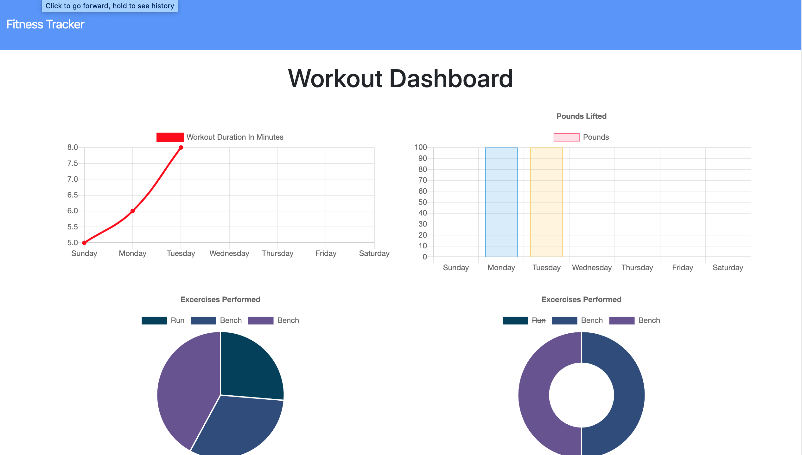

# FitToFailure
[https://fast-stream-10384.herokuapp.com/]

## Demonstration

## Table of Contents
* [Description](#description)
* [Installation](#installation)
* [Use](#use)
* [Technologies](#technologies)
* [Licensing](#licensing)
* [Contributors](#contributors)
* [Contributing](#contributing)
* [Github](#github) 

## Description
A full-stack application that uses MongoDB to store workout information. The last workout entered can be updated with new exercises and the information all displays on the dashboard too see the weeks progress. 
 
## Installation
1. Go to [https://github.com/timothymickiewicz/FitToFailure] and clone this repository.
2. Open terminal and paste the cloned URL into the location where you want this repository.
3. Open this application's directory in your terminal and run `npm install` to install dependancies.
4. `npm run seed` will install seeds if you wish to test it out.
5. Run `nodemon server` or `node server` to start the local server.
6. Open this application at [http://localhost:3000/] in your browser of choice. Google Chrome is suggested.

## Use
Visit the live-link at the top of this file to use the application via Heroku.
 
## Technologies
HTML5, CSS3, JavaScript, Node.js, MongoDB, Mongoose, Heroku, Express.js, EsLint, Moment.js, Path.js

## Licensing

 
## Contributors
Timothy Mickiewicz
* (shields.io) 
* (contributor-covenant.org)
 
## Contributing
 
Please note that this project is released with a Contributor Code of Conduct. By participating in this project you agree to abide by its terms. 
https://www.contributor-covenant.org/version/2/0/code_of_conduct/
 
## Contact
 
timothy.mickiewicz@gmail.com